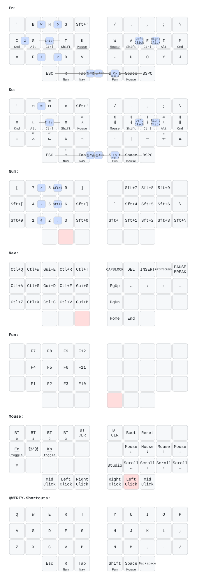

## zmk-config for crosses/bridges
This template is designed exclusively for the Wireless Crosses that utilize MiaoMiao’s customized PCB variant.

This library applies to the one-handed trackball variant.  
For the wireless 3x5 layout dual-trackball version, use this library:[zmk-for-crosses35-dual](https://github.com/HeeTuic/zmk-for-crosses35-dual)  
For the wireless 3x6 layout dual-trackball version, use this library:[zmk-for-crosses36-dual](https://github.com/HeeTuic/zmk-for-crosses36-dual)  
For the wireless 4x6 layout dual-trackball version, use this library:[zmk-for-crosses46-dual](https://github.com/HeeTuic/zmk-for-crosses46-dual)  

Keys are remapped in the browser using the [Keymap Editor](https://nickcoutsos.github.io/keymap-editor/).

